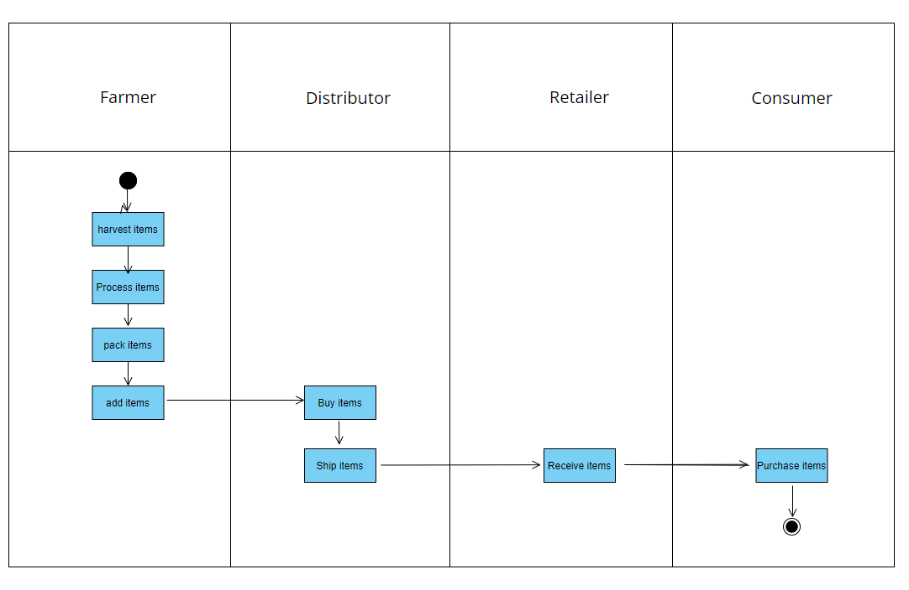

# Transaction Info

My Rinkeby Etherscan: https://rinkeby.etherscan.io/address/0xe26eb7c17f69b32d5cfa7566031b414d2bb0fe12

Transactions:
0x94bc0abf9a8227a16ee9798031f4aae833c302afab7958de3d7fa71198e35276
0xa3a0f86959521c2b3987345d2c67496a86ee608de2dfee69756d38f5c7a85db8
0x9576747280148a380dbbe35421319bb63e2a821787cc707b9a825693588664b5
0x1d9ab028c8142b66bd523ffcf9b3daa10d0615c7fc591972ee189919b8979296
0xcaf33c14b0e0da153b6b9cb199c34069e3f1f90fc6453d783de1476af81ce193
0x2ce95ab429c55b17490c639ae372bdd2de826a338b53c413f46f2039a75045e8

Contracts:
0xA77Fb2564926d23ed4422791cE6bDdaD134e4674
0x325A9160ac99B0484e390475010736237bB32207
0xF6E3Fe702F26ec9687E80d27b21aC81Ed545ff58
0x6E34899456a37C9Aa90Ea8Ca4D23120e80100284
0x5CA087fcf41355D9d0fac7E41691e953D2640E4D
0x3a144e72948Fa1bE7e12BD8847aEa1Ea8ef4A8C3


# Project write-up : UML

## Activity Diagram


## Sequence Diagram


## State Diagram


## Class Diagram


# Project write-up : Libraries

I used Roles library to manage access in the DApp. This simplifed the manage access restriction within DApp.
I also used @truffle/hdwallet-provider for migrating to Rinkeby

# Project write-up : IPFS

I did not create DApp to work with IPFS.


# Supply chain & data auditing

This repository containts an Ethereum DApp that demonstrates a Supply Chain flow between a Seller and Buyer. The user story is similar to any commonly used supply chain process. A Seller can add items to the inventory system stored in the blockchain. A Buyer can purchase such items from the inventory system. Additionally a Seller can mark an item as Shipped, and similarly a Buyer can mark an item as Received.

The DApp User Interface when running should look like...


## Getting Started

These instructions will get you a copy of the project up and running on your local machine for development and testing purposes. See deployment for notes on how to deploy the project on a live system.

### Prerequisites

Please make sure you've already installed ganache-cli, Truffle and enabled MetaMask extension in your browser.

```
Give examples (to be clarified)
```

### Installing

> The starter code is written for **Solidity v0.4.24**. At the time of writing, the current Truffle v5 comes with Solidity v0.5 that requires function *mutability* and *visibility* to be specified (please refer to Solidity [documentation](https://docs.soliditylang.org/en/v0.5.0/050-breaking-changes.html) for more details). To use this starter code, please run `npm i -g truffle@4.1.14` to install Truffle v4 with Solidity v0.4.24. 

A step by step series of examples that tell you have to get a development env running

Clone this repository:

```
git clone https://github.com/udacity/nd1309/tree/master/course-5/project-6
```

Change directory to ```project-6``` folder and install all requisite npm packages (as listed in ```package.json```):

```
cd project-6
npm install
```

Launch Ganache:

```
ganache-cli -m "spirit supply whale amount human item harsh scare congress discover talent hamster"
```

Your terminal should look something like this:


In a separate terminal window, Compile smart contracts:

```
truffle compile
```

Your terminal should look something like this:


This will create the smart contract artifacts in folder ```build\contracts```.

Migrate smart contracts to the locally running blockchain, ganache-cli:

```
truffle migrate
```

Your terminal should look something like this:


Test smart contracts:

```
truffle test
```

All 10 tests should pass.


In a separate terminal window, launch the DApp:

```
npm run dev
```

## Built With

* [Ethereum](https://www.ethereum.org/) - Ethereum is a decentralized platform that runs smart contracts
* [IPFS](https://ipfs.io/) - IPFS is the Distributed Web | A peer-to-peer hypermedia protocol
to make the web faster, safer, and more open.
* [Truffle Framework](http://truffleframework.com/) - Truffle is the most popular development framework for Ethereum with a mission to make your life a whole lot easier.


## Authors

See also the list of [contributors](https://github.com/your/project/contributors.md) who participated in this project.

## Acknowledgments

* Solidity
* Ganache-cli
* Truffle
* IPFS
